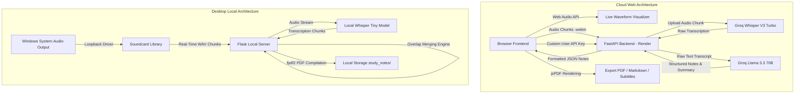
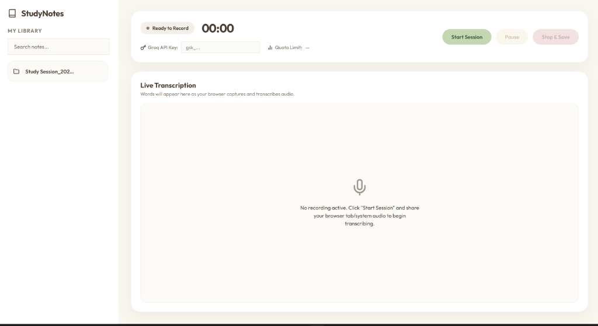

# Cozy Study Assistant & Notes Manager

A real-time audio transcription and structured AI study-notes generator. This repository features a dual-distribution design: a cloud-deployed Web application (FastAPI + Groq API) and an offline Desktop application (Flask + Local Whisper + Windows Loopback Audio). 

*   **Live Web Application**: [https://notes-assistant-frontend.vercel.app/](https://notes-assistant-frontend.vercel.app/)

---

## Architecture Overview

The codebase is split into two independent architectures to support both zero-install web usage and offline system audio recording.



### 1. Cloud Web Application
*   **Frontend**: A single-page application built with clean HTML5, CSS3, and Vanilla JavaScript. It leverages the browser's `MediaRecorder` API to capture tab or microphone audio, maps it to a `Web Audio API` canvas visualizer, and streams chunks to the API backend.
*   **Backend**: A FastAPI server running on Render that receives WebM audio streams, acts as a high-speed gateway to the Groq API, and performs asynchronous formatting and summarization.

### 2. Desktop Application
*   **System Audio Capture**: Solves the limitation of web browsers (which cannot capture overall OS sound outputs) by using the Python `soundcard` library to capture Windows WASAPI loopback speakers.
*   **Local Inference**: Runs a locally hosted OpenAI Whisper `tiny` model via PyTorch to enable transcription without sending audio data to third-party APIs.
*   **Distribution**: Packaged into a windowless standalone Windows `.exe` using PyInstaller.

---

## Features

*   **Dual Audio Engines**: Record from your browser tab/microphone in the cloud web app, or capture complete system loopback audio (speaker/video output) with the offline desktop client.
*   **Multi-Stage AI Summarization**: Uses Llama 3.3 70B to compile raw spoken text into clean, structured notes containing a TL;DR section, topic headers, bolded keywords, blockquote highlights, and automatically formatted code blocks.
*   **Single-Page Condensation**: Runs a secondary LLM pass to compress long sessions into a dense, one-page executive summary (cheat sheet).
*   **Real-time Waveform Visualization**: Leverages Web Audio API to render low-latency waveforms.
*   **Local PDF, Markdown, and SRT Exports**: Automatically generates formatted Markdown, PDF documents, and SRT subtitle files with corresponding timestamps.
*   **Quota & Limit Monitoring**: Connects to the Groq rate-limiting headers to display remaining request token quotas directly in the client settings panel.
*   **Clean Design System**: Features a responsive design tailored with a cozy pastel cream palette, Outfit typography, and glassmorphic UI cards.

---

## Folder Structure

```text
├── app.py                      # Desktop app entrypoint (Flask server + local Whisper loop)
├── build_exe.py                # PyInstaller build and packaging script
├── list_devices.py             # Audio device hardware diagnostic utility
├── requirements.txt            # Desktop environment python requirements
├── StudyNotesAssistant.spec    # PyInstaller specification file
├── backend/                    # FastAPI Web Backend
│   ├── app.py                  # API endpoints (Groq transcription, summarization, and quota checks)
│   ├── render.yaml             # Render deployment configuration
│   └── requirements.txt        # Backend dependencies
├── frontend/                   # Web Frontend (Vercel deployment)
│   ├── index.html              # Main application single-page interface (cozy styling & JS logic)
│   ├── vercel.json             # Vercel deployment configuration
│   └── api/
│       └── config.js           # Serverless utility to resolve environment backend URLs
├── static/                     # Desktop local assets (Flask static folder)
│   ├── app.js                  # Frontend interactions & local state management
│   └── style.css               # Styling guidelines for the desktop web UI
├── templates/                  # Desktop local views
│   └── index.html              # Flask interface layout
└── docs/
    └── screenshots/            # Repository screenshot assets
```

---

## Screenshots

Below is the live dashboard interface, showing the cozy user interface, the live transcription layout, and settings to load personal API keys:



---

## Installation & Running Locally

### Prerequisites
*   Python 3.10 or higher
*   FFmpeg (required for audio processing in Whisper)

### Running the Web Backend & Frontend Locally
1.  **Backend Setup**:
    ```bash
    cd backend
    python -m venv venv
    source venv/bin/activate  # On Windows: venv\Scripts\activate
    pip install -r requirements.txt
    ```
2.  **Environment Variables**:
    Create a `.env` file in the `backend/` directory:
    ```env
    GROQ_API_KEY=your_groq_api_key_here
    FRONTEND_URL=http://localhost:5000
    ```
3.  **Launch Backend**:
    ```bash
    uvicorn app:app --host 127.0.0.1 --port 8000 --reload
    ```
4.  **Frontend Setup**:
    If running locally, edit `frontend/index.html` to point to your local backend (`http://127.0.0.1:8000`), then serve the frontend folder with any simple server (e.g., `python -m http.server 5000`).

---

### Running the Desktop Application Locally
1.  **Install dependencies**:
    ```bash
    python -m venv venv
    source venv/bin/activate  # On Windows: venv\Scripts\activate
    pip install -r requirements.txt
    ```
2.  **Launch Application**:
    ```bash
    python app.py
    ```
    This launches the Flask local server, opens your web browser to `http://127.0.0.1:5000` automatically, and initializes the local offline Whisper model.

3.  **Packaging as a Standalone `.exe`**:
    To package the app into a single distributable file:
    ```bash
    python build_exe.py
    ```
    The standalone executable will be generated in the `dist/` folder.

---

## Engineering Challenges Highlight

### 1. Loopback Audio Capture on Windows
Web browsers are sandboxed and cannot access speaker output (loopback) directly. To build the desktop version, we integrated WASAPI loopback device access through `soundcard`. Because WASAPI drivers are sensitive to sample rates, we developed a MediaFoundation-based helper to query Windows devices for their native sample rate (often `48000Hz` or `44100Hz`), eliminating buffer underflows and sample-rate mismatches.

### 2. Overlap Merging and Hallucination Filtering
Whisper models running on short chunks often repeat segments or hallucinate phrase loops (e.g., *"like and subscribe"*) during silence. 
*   **Hallucination Filter**: We implemented noise floor check cutoffs (RMS < `0.0001`) and a low-confidence segment boundary filter.
*   **Merge Engine**: To join consecutive 6-second sliding window audio outputs without text repetition, we created a trailing word-suffix comparison algorithm (`merge_overlapping_text`). This sanitizes incoming text, aligns punctuation, and merges overlapping boundaries seamlessly.

### 3. PyInstaller Environment Bundling
Compiling large ML setups into a PyInstaller bundle introduces packaging bugs. We implemented:
*   A runtime redirector (`DummyWriter`) for stdout/stderr to prevent print-statement crashes when running windowless.
*   Runtime injection of bundled `imageio-ffmpeg` binary paths into the system `PATH` to ensure Whisper can always locate FFmpeg.
*   A monkey-patch for `numpy.fromstring` to ensure older binary libraries compiled for NumPy 1.x remain compatible with modern NumPy 2.x environments.
